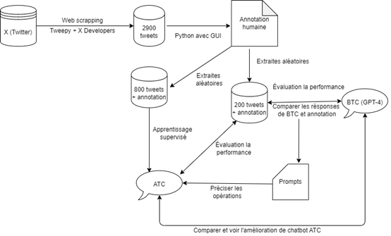
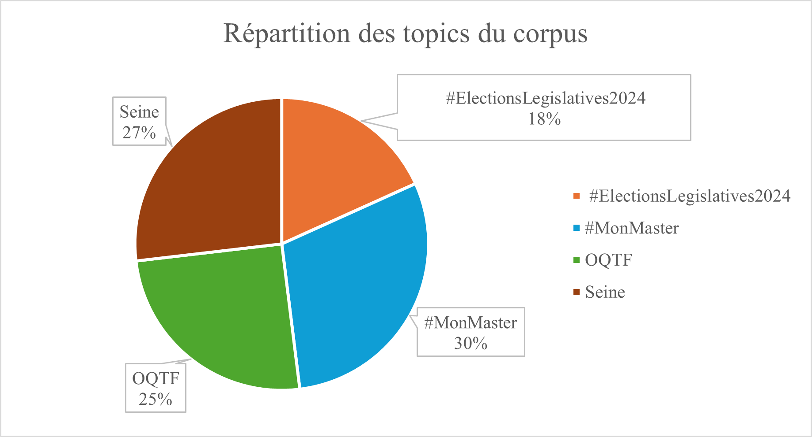

# Research of the optimization of LLM-based chatbots in response to inappropriate behaviors in French conversations using semantic analysis

This research explores the optimization of chatbots, with a particular focus on their ability to manage inappropriate behaviors in French conversations.

The chatbot is based on GPT-4, an LLM model, and Langchain. To enrich the study, a corpus of tweets was created around the following themes: #ElectionsLegislative, #MonMaster, OQTF (Obligation de Quitter le Territoire Français), and Seine. This corpus was carefully annotated to analyze the chatbot's responses and its behavior when interacting with potentially inappropriate content. Manual annotations were used to categorize the data into several categories, such as appropriate behavior, personal insecurity, and insecurity toward others, to better understand the challenges and improve the chatbot's responses.

After observing and analyzing the chatbot's responses, the main issues identified were false positives, aggression, overly conservative avoidance, misunderstandings, avoidance of interactions, exacerbated aggression, inappropriate teasing, and inappropriate suggestions. To address these issues, 800 annotated tweets were used as input for supervised learning, with prompts serving as instructions for generating responses for the chatbot. As a result, the quality of the chatbot improved significantly, leading to more appropriate and continuous human-machine interactions.

# Installation

Please see [requirements.txt](requirements.txt) for installation.

Before running these codes, you need to set the following in [settings.py](settings.py):


```python
API_URL = ""
API_KEY = ""
```

The above **API URL** and **API KEY** need to be obtained from [Langchain](https://www.langchain.com/).

# Guideline

Research approach in French schema is as follows:



In short, after collecting a corpus via X (Twitter), a chatbot named BTC was built using LangChain and OpenAI's GPT-4 model to answer questions based on tweet content. However, since the tweets themselves might contain inappropriate behavior, the dialogue could become toxic or have other negative impacts. To address this, fine-tuning is necessary through manual annotation and prompt guidance to improve its performance. The resulting chatbot is called ATC.

Distribution of topics in the corpus:



[chatbot_atc.py](chatbot_atc.py) is a fully developed bot capable of responding appropriately to inappropriate behavior and is ready for direct use.

# Performances

Chatbot BTC:

Precision (BTC) = 0.36
Recall (BTC) =  0.29
F-score (BTC) = 0.32

Chatbot ATC:

Precision (BTC) = 0.89
Recall (BTC) =  0.95
F-score (BTC) = 0.92

# Paper of this research

[Étude de l'optimisation des chatbots basés sur LLM face aux comportements inappropriés dans les conversations françaises à l'aide de l'analyse sémantique](Étude%20de%20l'optimisation%20des%20chatbots%20basés%20sur%20LLM%20face%20aux%20comportements%20inappropriés%20dans%20les%20conversations%20françaises%20à%20l'aide%20de%20l'analyse%20sémantique.pdf)

Powerpoint for the presentation:

[presentation](presentation.pdf)
